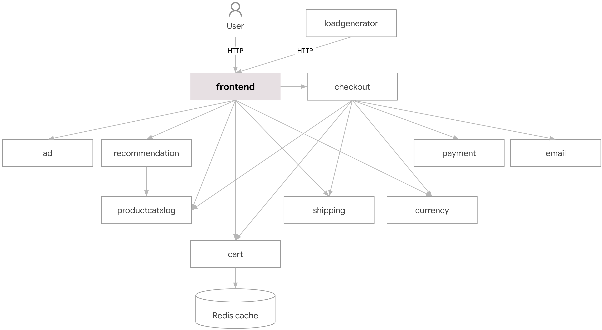
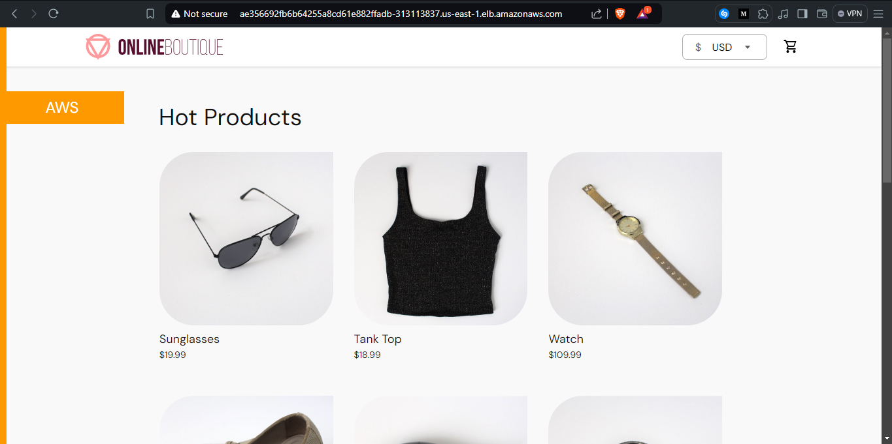
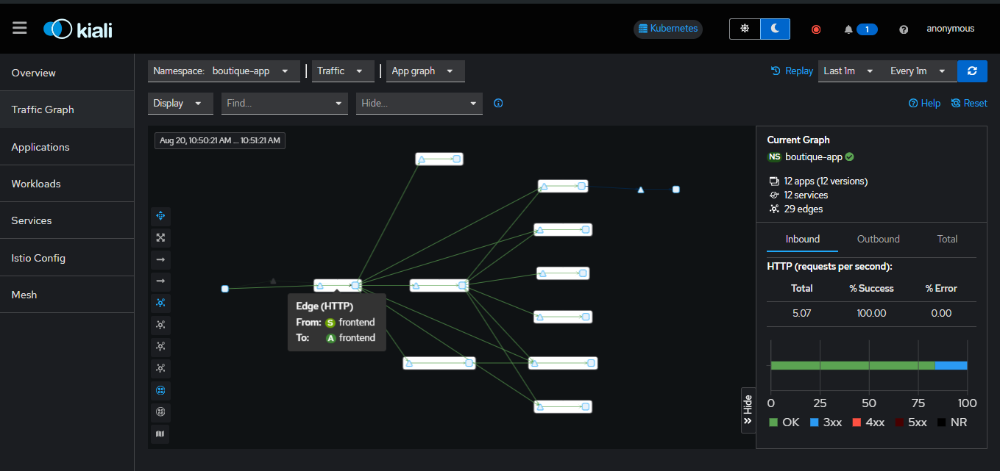
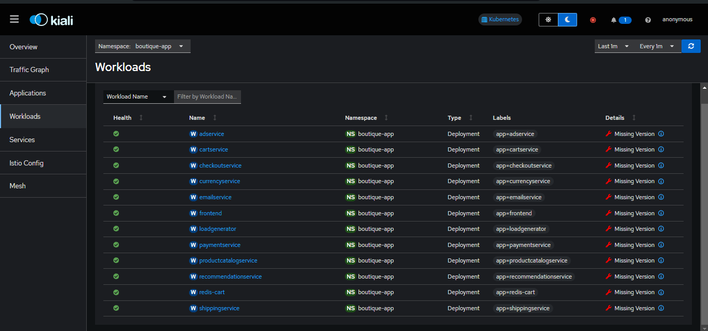
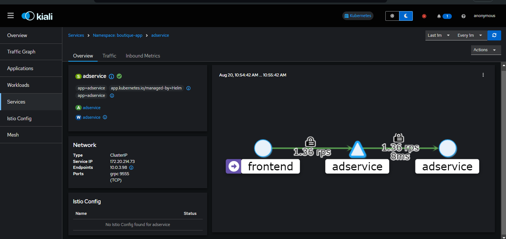

# Setting up Istio Service Mesh on AWS EKS
This repository sets up AWS networking resources, EKS Cluster, Bootstraps the cluster with EKS, and finally, installs a microservice application helm chart provided by Google cloud.

The application is an e-commerce store application that includes 10 micro services, a load generator and Redis data store. These microservices interact with themselves using gRPC protocol calls. Each microservice is written in different programming languages to demonstrate how dicerse microservice architectures can be.



## Istio
Istio is an open source kubernetes service mesh tool. It ensures that microservice applications can easily interact with themselves easily, securely and can be observed indepedently. 

With istio, api requests between microservices are secured with TLS connections between themselves. This service mesh concept is achieved using a proxy container that istio injects into deployments/pods in the cluster.

The proxy container strategy istio uses to enable service discovery is a game changer because you won't need to change any deployment configuration... All you'll need to do is to enable istio injection into the namespace you're deploying to.

## Istio Ingress
Istio also comes with an Ingress controller, an alternative to Nginx loadbalancers. It comes with more features and is more dynamic than nginx the nginx controller. In this project, we expose the frontend service using the istio ingress load balancer URL.


## AWS Architecture
To set up the deployment enviroment to demonstrate istio on the cloud, we make use of Infrastructure as code concepts specifically using terraform to set up the AWS resources below:

- VPC
- Public Subnets
- Private Subnets
- EKS Cluster
- Node Groups (3 nodes)

## Spin Up the Environment
To spin up this environment on an AWS account, ensure you have the AWS CLI installed and Terraform installed. Also ensure that you have your AWS access keys set up. Kubectl is also required to have.

The e-commerce boutique application is installed using the terraform helm provider. So you don't need to have helm installed to set this up. All you need is terraform and it automates the process.


initialize the environment and spin up the environment using terraform 

```
terraform init
terraform validate
terraform apply --auto-approve
```

Once terraform applys successfully, you can then update the kube config on your local machine using the command below

```
aws eks update-kubeconfig --region us-east-1 --name istio-demo
```

Confirm that istio is installed and running

```
kubectl get pods -n istio-system 
```

```
NAME                      READY   STATUS    RESTARTS   AGE
istiod-5f7944b777-2rfrl   1/1     Running   0          4m47s
```

Also confirm if the istio ingress we talked about is running

```
kubectl get pods -n istio-ingress
```

```
NAME                             READY   STATUS    RESTARTS   AGE
istio-ingress-586b49fb9c-42w2z   1/1     Running   0          4m54s
```

You can then confirm if the micro service application is running and istio if istio injected the proxy pods:

```
kubectl get pods -n boutique-app 
```

```
NAME                                     READY   STATUS    RESTARTS   AGE
adservice-766c974448-w8zw7               2/2     Running   0          5m32s
cartservice-77549b5fd5-gv669             2/2     Running   0          5m32s
checkoutservice-7998f957b-h5jqw          2/2     Running   0          5m31s
currencyservice-6b8bcdcb56-4dt75         2/2     Running   0          5m31s
emailservice-b745c6cb4-zzwkf             2/2     Running   0          5m31s
frontend-8dbfd7cf-z26lw                  2/2     Running   0          5m32s
loadgenerator-5c9cc8f859-dhs28           2/2     Running   0          5m31s
paymentservice-68f5d8498d-xkpph          2/2     Running   0          5m31s
productcatalogservice-8547978dd-c8dq9    2/2     Running   0          5m31s
recommendationservice-56c9f8f46b-gjnr2   2/2     Running   0          5m32s
redis-cart-b57f7b458-mpsqp               2/2     Running   0          5m31s
shippingservice-6cf6fcd654-8ngmn         2/2     Running   0          5m32s
```

To access the frontend UI of this application, get the load blancer URL of the istio ingress.

```
kubectl get svc -n istio-ingress
```

In my case, the out put was:
```
NAME            TYPE           CLUSTER-IP     EXTERNAL-IP                                                              PORT(S)                                      AGE
istio-ingress   LoadBalancer   172.20.72.52   a733be36325534d75980060c6e351358-746124157.us-east-1.elb.amazonaws.com   15021:30492/TCP,80:31318/TCP,443:32143/TCP   7m47s
```

You can then proceed to use the URL in a browser to access the UI. 



NB: If the loadbalancer does not return the frontend, use the command below to restart the istio loadbalancer controller deployment.

```
kubectl rollout restart deployment istio-ingress -n istio-ingress
```
## Kiali (Optional)

Optionally, you can install kiali to get a visual representation of how these microservices are interwoven and to have a high level view to monitor them and check their health.

Kiali works closely with prometheus to fetch metrics so to set it up, create kiali and prometheus using the command below

```
kubectl apply -f ./istio-manifests/kiali.yaml
kubectl apply -f ./istio-manifests/prometheus.yaml
```

Confirm that kiali and prometheus are running using the command below:

```
kubectl get pods -n istio-system
```

```
istiod-5f7944b777-f5bdt       1/1     Running   0          50m
kiali-65c46f9d98-tnpln        1/1     Running   0          18m
prometheus-68b4644d5c-2r5nh   2/2     Running   0          13m
```

If they are all running, you can then use a port forward to access the kiali UI and have a visual view of all application services health

```
kubectl port-forward --namespace istio-system svc/kiali 20001 
```

You can access the UI on `localhost:20001`







## Clean Ups

To remove all resources created, first delete prometheus and kiali

```
kubectl delete -f ./istio-manifests/kiali.yaml
kubectl delete -f ./istio-manifests/prometheus.yaml
```

Proceed to clean up all infrastructure resources on AWS including EKS using terraform.

```
terraform destroy --auto-approve
```